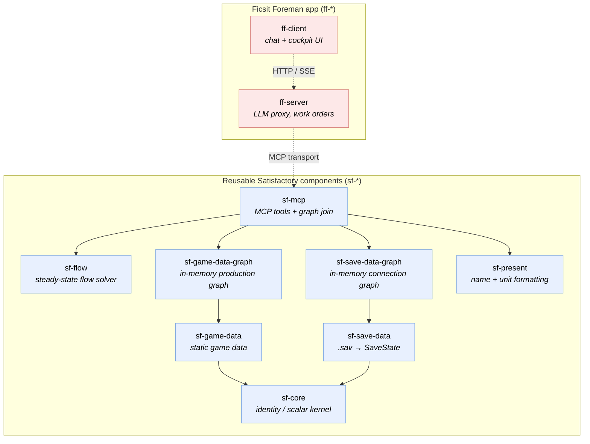

# FICSIT Foreman — Component Architecture (target)

How the codebase decomposes into reusable, community-shippable Satisfactory components
(`sf-*`) cleanly separated from the Ficsit Foreman application (`ff-*`). The package split
described here is now **realised** — all `sf-*`/`ff-*` packages exist with these boundaries;
this doc is the **rationale and the guards** that keep them clean for an eventual per-repo
split. See [`architecture.md`](./architecture.md) for how the system fits together *today*.
What remains "target" is the repo split itself (we still publish from this monorepo).

---

## Why

Today we build save / game-data capabilities just-in-time for what the foreman needs.
Through a community lens, the **parsers, graphs, and MCP servers** are valuable in
their own right — the Satisfactory community lacks clean, typed, queryable tooling of
this kind. So the goal becomes a *coherent, domain-complete set of capabilities at each
layer* that any consumer can pick from, with the foreman as the **first consumer** that
validates the design. Eventually each `sf-*` component ships from its own repo; **for
now we publish from this monorepo**, designing the boundaries so the eventual split is
mechanical rather than surgical.

Two domains, three layers each:

- **Game data** (static — what the game *contains*): parser → graph → (MCP).
- **Save game** (dynamic — a player's *instance*): parser → graph → (MCP).

---

## Decisions

1. **Three layers per domain, strict downward dependencies:** parser → (nothing);
   graph → parser; MCP → graph + parser. **No app concerns leak downward** — work
   orders, playthroughs, BYOK, and the foreman persona stay in `ff-server`.
2. **"Completeness" differs by layer:**
   - Parser + graph → aim **domain-complete** (the data model is finite and objective).
   - MCP → **curated high-value tools + a generic query escape hatch** (don't chase a
     bespoke tool per question; expose the graph for power users).
3. **The two graphs are independent but composable.** They share class-name keys
   (`Desc_*`, `Recipe_*`, `Build_*`). The save graph stays **game-data-agnostic** (it
   stores class-name strings); joining to recipes/buildings is the consumer's choice —
   the in-process join the foreman performs today.
4. **Raw in the neutral layers; format at the edge** — see *Presentation boundary*.
5. **Publish from the monorepo now; design for clean extraction later.** Internal
   boundaries should already behave as if the packages were separate repos: depend only
   on another package's *published surface* (never deep `../other/src/...` paths), carry
   an own README/version, and build + test standalone. Reusable Satisfactory code lives
   in `sf-*`; app concerns live in `ff-*`.

---

## Presentation boundary — raw in the layers, format at the edge

Neutral layers (`sf-core`, and the `parser`/`graph` of each domain) return **raw,
game-native, faithful** data. **Formatting and cross-domain enrichment happen at the
edge** — the MCP tool layer (`sf-mcp`) and `ff-*` — so the reusable layers stay honest
and each consumer formats to taste.

**Moves to the edge (out of the neutral layers):**

- **Unit conversion** — `cmToMetres` / `metresToCm` / `vecToMetres`. Graph and parser
  keep **centimetres** (the save's native unit); the MCP/app converts to metres "for
  the HUD". ✅ Done — `cmToMetres`/`metresToCm` live in **`@foreman/sf-present`** (the
  reusable presentation lib); `vecToMetres` is local to the save selectors.
  `WorldQueries` returns raw centimetres.
- **Compass bearing** (`compassBearing`) — a derived, human-facing direction. ✅ Done
  (`@foreman/sf-present`).
- **Numeric rounding** — ✅ the parser no longer rounds (`round4` removed); `GameData`
  carries full-precision rates and the graph rounds only computed query output.
  **Duration formatting** ("12h 34m") stays at the edge.
- **Cross-domain display-name enrichment** — upgrading a save's `Desc_*` class to the
  game's authored display name is a *join across both graphs*; it lives at `sf-mcp`,
  not inside `sf-save-data` (keeps the save graph game-data-agnostic, per decision 3).
  ✅ Done — `SaveState` carries raw class names; `sf-mcp` selectors resolve via
  `makeNameResolver(game)`.
- **`humaniseClassName`** — the cosmetic class → Title-Case fallback. ✅ Done — lives in
  **`@foreman/sf-present`**; the neutral parser/graph/save libs emit raw class names (or
  `''`) and only the edge humanises.

**Stays in the neutral layers (don't over-correct):**

- `classNameFromPath`, `extractClassNames` (structural identity), `distance` / geometry
  (pure maths), `Vec3` (shared type) → `sf-core`.
- Computed *domain* quantities — `perMinute`, `craftTime`, stack sizes — and the game's
  authored `displayName` (a domain fact from `Docs.json`) → the relevant `sf-*` data lib.

Net: **`sf-core` narrows to a structural/identity kernel** (class-name resolution,
shared scalar types, channel/version logic) — no unit or formatting helpers. Those
presentation helpers live in **`@foreman/sf-present`** (reusable without the MCP server).

---

## Packages

| Package | Role |
|---|---|
| **`sf-core`** | Slim shared kernel: class-name resolution (identity), shared scalar types (`Vec3`), channel/version logic. No formatting helpers. |
| **`sf-present`** | Reusable presentation/formatting helpers — `humaniseClassName`, `cmToMetres`/`metresToCm`/`compassBearing`. Zero-dep leaf; usable without the MCP server. |
| **`sf-flow`** | Pure steady-state material-flow solver — abstract network (per-item supply/demand, edge caps + filters) → delivered rates + throughput. Zero-dep leaf; game-data-agnostic (the `sf-mcp` adapter maps the save graph + game data onto it). Backs `find_bottlenecks`. |
| **`sf-game-data`** | Static reference data: the offline C# extractor's merged `sf-game-data.json` (recipes / buildings / items + world-locations) loaded at runtime (→ `sf-core`). |
| **`sf-game-data-graph`** | The game-data production graph **as a library** — a pure **in-memory** facade over `GameData` (item→recipe adjacency maps + TS traversal; no database, no native addon) (→ `sf-game-data`). |
| **`sf-save-data`** | A player's save instance: the adopted @etothepii parser + normalise into the complete `SaveState` (incl. `topology`) (→ `sf-core`). |
| **`sf-save-data-graph`** | The save-game connection graph **as a library** — a pure **in-memory** projection of `SaveState.topology` (no native deps, no facts of its own); provides adjacency, power circuits, splitter rules, and kind-aware directed-flow inference (→ `sf-save-data`). |
| **`sf-mcp`** | Single, **domain-neutral** MCP server loading *both* graph libs (+ `sf-flow`, `sf-present`) and exposing their tools — **including cross-graph (save ↔ game-data) join tools** like `find_bottlenecks`. The one place the two domains meet; holds the effective-game-data join seam. |
| **`ff-server`, `ff-client`** | The Ficsit Foreman app (`ff` = Ficsit Foreman). `ff-server` runs the LLM proxy + MCP gateway (talks to `sf-mcp`) and injects the work-order tools per request; `ff-client` is the React/Vite chat + work-order cockpit. |

**Namespace:** `sf-*` are the reusable, community-shippable components; `ff-*` are the
app. The prefix marks which side of the reuse boundary a package sits on.

**Dependency DAG (acyclic).** Solid arrows are npm/compile-time dependencies; dashed
arrows are runtime edges (`ff-client → ff-server` over HTTP/SSE, `ff-server → sf-mcp` over
the MCP transport via the gateway — `ff-server` does not `import` `sf-mcp`). Every `sf-*`
package is now **pure TypeScript with no native dependency**: both graph libraries are
in-memory projections over their source data (the game-data graph dropped its embedded
Kùzu engine in #243), so no native addon reaches any package.

Text form (deps point right-to-left): `sf-core ← {game,save}-data ← {game,save}-data-graph
← sf-mcp ← ff-server ← ff-client`; `sf-present` and `sf-flow` are zero-dep leaves consumed
by `sf-mcp` (it also imports `sf-game-data`/`sf-save-data` directly for their loaders/types).

### Guards

- The reusable artifact is the **graph-as-a-library**, not the MCP server — done: both
  graphs ship as standalone libs (`sf-game-data-graph`, `sf-save-data-graph`) that `sf-mcp`
  composes. Keep it that way; never re-fuse graph + MCP.
- **Guard `sf-mcp`'s contents:** it does exactly one thing — expose + join the two
  graphs. Foreman *business* logic (work orders, playthroughs, BYOK, persona) stays in
  `ff-server`. The neutral name is itself the guard; leaking app logic into `sf-mcp` is
  the one thing that would break reuse. The name `foreman-mcp` is **reserved** for a
  genuinely foreman-specific MCP server (e.g. exposing work-order tooling over MCP) if
  one ever exists.
- **Per-domain standalone MCP servers** (`sf-game-data/mcp`, `sf-save-data/mcp`) are
  deferred to repo-split time (foreman-first). `sf-mcp` composes the graph libs directly
  regardless. A deliberate choice — revisit if a community need arrives sooner.
- README of each data package should state the distinction: `sf-game-data` = static
  reference (what the game contains) vs `sf-save-data` = a player's instance.

---

## Third-party save parser (`@etothepii/satisfactory-file-parser`)

- **License: MIT** (v4.1.x), pulled as a normal npm dependency (not vendored) — so no
  copyleft constraint on `sf-save-data`'s license; just preserve attribution. We
  *depend*, not redistribute source, so this is the low-friction case.
- **Asymmetry:** unlike `sf-game-data` (we own the parser), `sf-save-data` is an
  **adapter + clean model** over etothepii — the binary `.sav` parsing is theirs
  (mature; not worth reinventing).
- **Insulation (in place):** `parseSaveFile` is the *sole* boundary to etothepii; we keep
  our own minimal `RawSave`/`RawObject` types and expose our own `SaveState` (the graph is
  a separate package projecting it). etothepii stays an implementation detail behind one
  module, so a save-format change — or even a parser swap — touches one file, not the
  public API. Keep this strict.
- **Risk/contingency:** we are downstream of etothepii's release cadence for save-format
  updates; mitigated by the boundary, with fork/vendor as the *fallback* (precedent: the
  vendored world-locations extractor), not the default. Community posture: contribute
  fixes **upstream** rather than fork-first.

---

## Open threads (deferred — not blocking this doc)

- Licensing of the **bundled game data** (Coffee Stain's `Docs.json` / `en-US.json` in
  `sf-game-data`) — what can ship standalone. (The save parser is resolved: MIT.)
- ~~The save graph's **build/cache lifecycle** — Kùzu-per-save vs an in-memory adjacency
  structure.~~ ✅ Resolved (#122): a pure **in-memory** projection (rebuilt per parse,
  mtime-gated), ~150 ms vs ~5 s for Kùzu — so the save graph carries no native deps.
- ~~Whether the **game-data graph** needs its embedded **Kùzu** engine.~~ ✅ Resolved
  (#243): dropped for in-memory item→recipe adjacency maps — every query already re-derived
  data present on `GameData`, and Kùzu cost ~3 s per boot + a ~541 MB native addon for no
  capability the foreman used. No `sf-*` package carries a native dependency now.

---

## Sequencing

Foreman-first. The path that got here (all shipped):

1. ✅ **Save-game graph foundation** (`sf-save-data-graph`) — the general connection graph
   as a library (in-memory; the substrate all relational save tools query).
2. ✅ **Power** — the first, cheapest consumer (`FGPowerCircuit` pre-groups circuits).
3. ✅ **Actual production accounting** — the steady-state flow engine (`sf-flow` + the
   `find_bottlenecks` adapter: feed-tracing over belts/splitters/pipes with splitter
   filters + fluid head lift). Closed #148 / #126 / #190.
4. ✅ **Package restructure** — the `sf-*`/`ff-*` split is in place.

Remaining: the **per-repo split** (still monorepo) and the #172 Advanced-Game-Settings
modifier overlay. Live work is tracked in the
[issue tracker](https://github.com/StuartMeeks/ficsit-foreman/issues).
